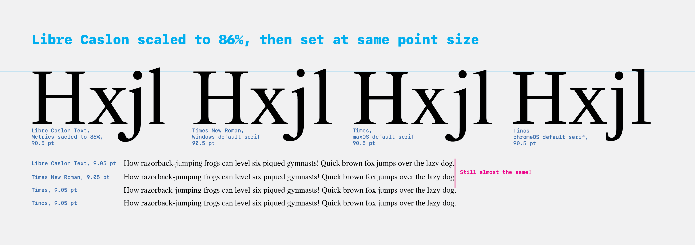

# Experiments / Early work

## Italic

It appears that some of the italic may have been created by half-rotating, half-slanting the romans.


Above, from left to right:

- the existing italic `g`
- a `g` rotated 15° and skewed 5°
- a `g` rotated 10° and skewed 10° (this one looks pretty close to the current real version)
- a `g` rotated 5° and skewed 15°
- a `g` skewed 20°

This approach could be a quick starting point for the Bold Italic. On the other hand, it might mean that we should throw out much of what currently exists for the regular Italic, in order to do it better…

## Normalizing Metrics

### Metrics

**Goal:** get Libre Caslon Text to be similar in size to the most common default "serif" web fallbacks: Times New Roman, Times, and Tinos. This doesn't need to be *exact* (every font is a little bit different in body size, and that's fine) but it will be useful to designers to have it in the same ballpark.

**Question: should we normalize vertical metrics or horizontal metrics?**

The primary purposes of matching metrics are:

1. Making Libre Caslon match the appearance of size of fallback fonts so that users aren't overly jarred by changing sizes of fonts as they load
2. Making Libre Caslon predictable to design with, so web developers can try it in place of other fonts
3. Preventing excessive text reflow when the font is loaded or used

If we wanted to prevent reflow as much as possible, we could match the width metrics of Times New Roman. However, because the overall width will change with the design of each letter (e.g. I intend to re-look at the widths of letters `n, u, h, m`), this is a very "slippery" goal. If users want an exact match, they can use [Tinos](https://fonts.google.com/specimen/Tinos).


Instead of making the design completely subservient to matching TNR, I will blend the two approaches: I will roughly match vertical metrics, choosing the matching method based on what causes the least overall reflow from Times New Roman.

**Process:** opening font files in Glyphs to find metrics. Multiplying by .48828125 and rounding to compute from 2048 to 1000 UPM.

| Font                      | Asc        | Cap        | xHght     | Dsc        | UPM (normalized) | Asc+dsc    |
| ------------------------- | ---------- | ---------- | --------- | ---------- | ---------------- | ---------- |
| Libre Caslon Text Regular | 820        | 770        | 530       | -250       | 1000             | 1070       |
| Libre Caslon Text Bold    | 820        | 770        | 530       | -250       | 1000             | 1070       |
| Libre Caslon Display      | 734        | 690        | 424       | -266       | 1000             | 1000       |
| Times New Roman           | 1420 (693) | 1356 (662) | 916 (447) | -442 (216) | 2048 (1000)      | 1862 (909) |
| Times (can't find file)   | -          | -          | -         | -          | -                | -          |
| Tinos                     | 1420 (693) | 1341 (655) | 940 (459) | -442 (216) | 2048 (1000)      | 1862 (909) |


**Matching:** In matching the overall visual size of Libre Caslon to Times New Roman and other common fonts, there are three obvious ways to match the visual sizes with vertical metrics: by matching ascender-to-descender height, by matching x-height, or by matching cap height. 

Matching full ascender-to-descender height makes fallback fonts look clearly bigger.

Most design manuals advise matching the visual sizes of different fonts by matching x-heights. This makes sense, because the large majority of letters in most text are lowercase. 

However, a quick (approximate) test of matching the cap heights of Libre Caslon with the cap height of Times New Roman shows that it comes remarkably close to matching line-lengths:


...so, I'll scale Libre Caslon so that the cap height matches Times New Roman. Some simple math:

```python
LCcap = 770 * 2.048 # 1576.96, set to 2048 UPM

TNRcap = 1356

capDiff = LCcap/TNRcap # 0.8598823051948051
```

This tells me I should scale all letters and all metrics in Libre Caslon on the (0,0) point by 85.8598823051948051%.


I'll do this with [Georg's recommended technique](https://forum.glyphsapp.com/t/how-to-scale-an-entire-font/2477), scaling to 860, then changing back to 1000:

> Scale it to a smaller UPM in Font Info > Font (the the arrow button next to the UPM value). Then set the UPM back to 1000 by typing in the text field.

With a quick export and check of this scaled version, it is clear that this sizing approach works better than the prior version alongside other fonts:**




