# Experiments / Early work


## Normalizing Metrics

### Metrics

**Goal:** get Libre Caslon Text to be similar in size to the most common default "serif" web fallbacks: Times New Roman, Times, and Tinos. This doesn't need to be *exact* (every font is a little bit different in body size, and that's fine) but it will be useful to designers to have it in the same ballpark.

**Question: should we normalize vertical metrics or horizontal metrics?**

The primary purposes of matching metrics are:

1. Making Libre Caslon match the appearance of size of fallback fonts so that users aren't overly jarred by changing sizes of fonts as they load
2. Making Libre Caslon predictable to design with, so web developers can try it in place of other fonts
3. Preventing excessive text reflow when the font is loaded or used

If we wanted to prevent reflow as much as possible, we could match the width metrics of Times New Roman. However, because the overall width will change with the design of each letter (e.g. I intend to re-look at the widths of letters `n, u, h, m`), this is a very "slippery" goal. If users want an exact match, they can use [Tinos](https://fonts.google.com/specimen/Tinos).

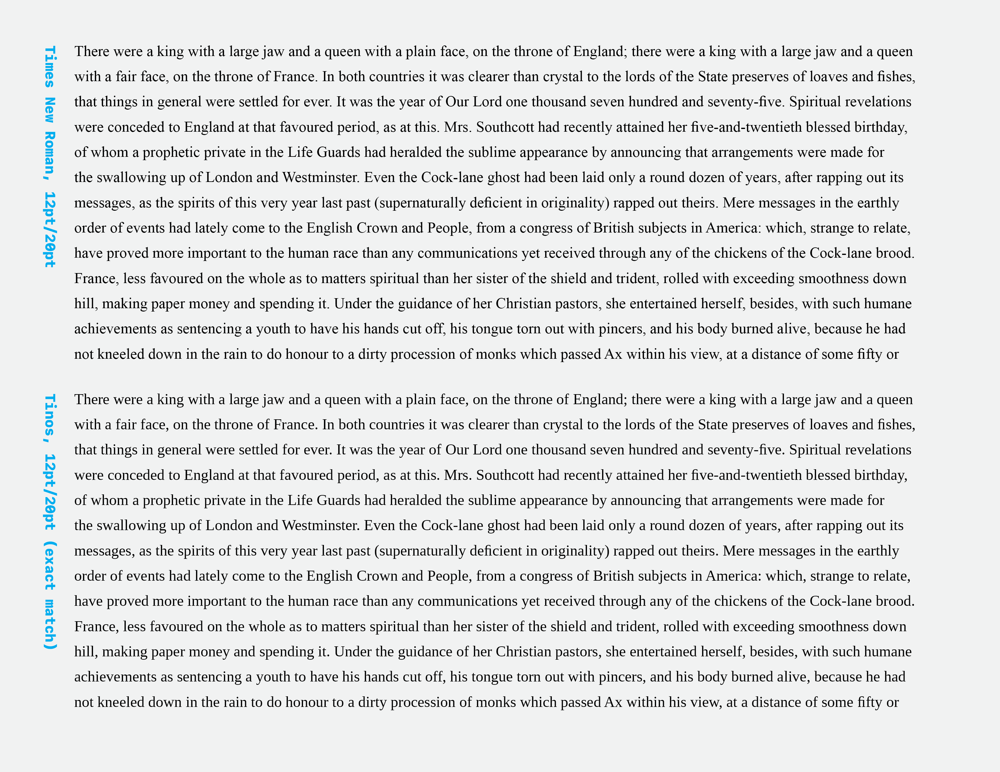

Instead of making the design completely subservient to matching TNR, I will blend the two approaches: I will roughly match vertical metrics, choosing the matching method based on what causes the least overall reflow from Times New Roman.

**Process:** opening font files in Glyphs to find metrics. Multiplying by .48828125 and rounding to compute from 2048 to 1000 UPM.

| Font                      | Asc        | Cap        | xHght     | Dsc        | UPM (normalized) | Asc+dsc    |
| ------------------------- | ---------- | ---------- | --------- | ---------- | ---------------- | ---------- |
| Libre Caslon Text Regular | 820        | 770        | 530       | -250       | 1000             | 1070       |
| Libre Caslon Text Bold    | 820        | 770        | 530       | -250       | 1000             | 1070       |
| Libre Caslon Display      | 734        | 690        | 424       | -266       | 1000             | 1000       |
| Times New Roman           | 1420 (693) | 1356 (662) | 916 (447) | -442 (216) | 2048 (1000)      | 1862 (909) |
| Times (can't find file)   | -          | -          | -         | -          | -                | -          |
| Tinos                     | 1420 (693) | 1341 (655) | 940 (459) | -442 (216) | 2048 (1000)      | 1862 (909) |


**Matching:** In matching the overall visual size of Libre Caslon to Times New Roman and other common fonts, there are three obvious ways to match the visual sizes with vertical metrics: by matching ascender-to-descender height, by matching x-height, or by matching cap height. 

Matching full ascender-to-descender height makes fallback fonts look clearly bigger.

Most design manuals advise matching the visual sizes of different fonts by matching x-heights. This makes sense, because the large majority of letters in most text are lowercase. 

However, a quick (approximate) test of matching the cap heights of Libre Caslon with the cap height of Times New Roman shows that it comes remarkably close to matching line-lengths:

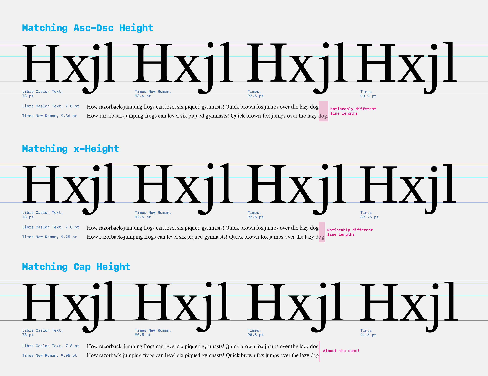

...so, I'll scale Libre Caslon so that the cap height matches Times New Roman. Some simple math:

```python
LCcap = 770 * 2.048 # 1576.96, set to 2048 UPM

TNRcap = 1356

capDiff = LCcap/TNRcap # 0.8598823051948051
```

This tells me I should scale all letters and all metrics in Libre Caslon on the (0,0) point by 85.8598823051948051%.

I'll do this with [Georg's recommended technique](https://forum.glyphsapp.com/t/how-to-scale-an-entire-font/2477), scaling to 860, then changing back to 1000:

> Scale it to a smaller UPM in Font Info > Font (the the arrow button next to the UPM value). Then set the UPM back to 1000 by typing in the text field.

With a quick export and check of this scaled version, it is clear that this sizing approach works better than the prior version alongside other fonts.

### Alternative scaling approach

As a secondary approach to give points a better chance to avoid rounding problems, I have also tried scaling *up* to about 85.859% of 2048. 2048 is also a valid UPM setting, and scaling up will mean that points are jostled less by rounding to integer coordinates (because there will essentially be a higher resolution for outlines). For simplicity, I scaled the UPM to 1760, then changed the UPM to 2048. I repeated this process for the Text Italic to match vertical metrics there, as well.

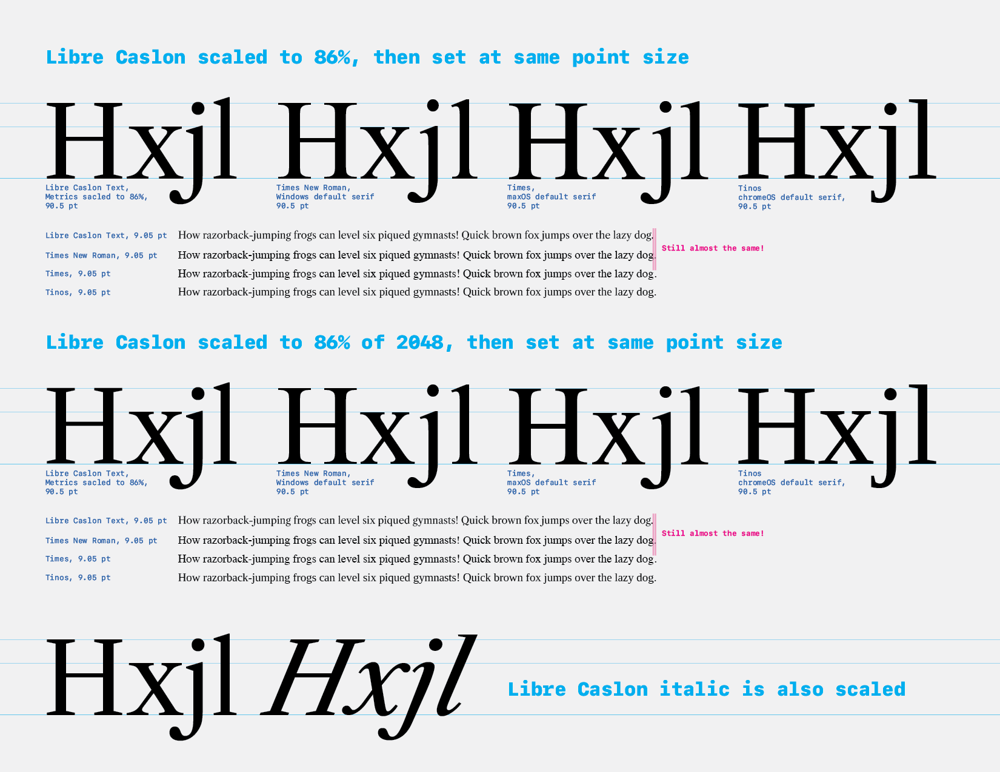

### How might I test to check that point structures haven't been distorted by scaling?

When glyphs are scaled, points usually move from integer coordinates (e.g. x: 128, y: 540) to floating-point numbers (e.g. x: 109.89952, y: 463.6386). These must then be rounded to the nearest integer coordinates in order to export at a reasonable file size, resulting in slight shifts to points. 

To check that that things haven't been distorted too badly, I could make a script to scale without rounding, then check differences with the version which was scaled and rounded. *However,* I believe that work would be mostly pointless, because:
- Rounding, by its nature, will only move a point by less tha 1 unit `x` & `y`, unless GlyphsApp is doing some very unexpected math.
- The main concerns of rounding after transformation is that things will no longer line up as needed. This is most impactful if 
    - Points are suddenly missing a key alignment zone such as the baseline, x-height, cap height, ascender height, or hinting blue zone. This is not the case.
    - If a very thin stroke on a diagonal letter such as `K` is suddenly misaligned on either side of an intersection. A spot check shows that this is not the case in the scaled versions. I will have to be more cautious when working in the Libre Caslon Display masters, where thin strokes are thinner, and thus have a smaller margin of acceptable error.

### Scaling Libre Caslon Display

I've tried the same approach to scaling the Display, scaling it to 1760 UPM, then changing the UPM to 2048. However, due to its original major difference in Cap Height and x-Height from LC Text, it is again way too small:

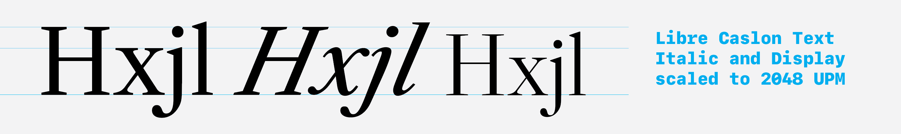

So, LC Display should have its own scaling approach. But should it again try to match the cap height of Times New Roman, or should it be based off of the sizing of LC Text? Because it should work best with its own family members, it seems obvious that it needs to be scaled based off of the LC Text. 

But how, exactly, should the metrics of a display font related to the metrics of a text font, if they are set at the same point size? Should the cap height be matched, allowing the x-height to change? Or should the x-height be matched, allowing the Cap height to change? I lean towards the latter, because caps appear less frequently in most text, and I therefor consider them to be less of a foundation of a font's size than the x-height. However, is there an industry standard for how font metrics should relate between text and display versions?

**Seeking a standard of `opsz`**

I took my question to [v-fonts.com](https://v-fonts.com) to see what other type designers are doing for `opsz` font metrics. I updated the text areas to hold the following HTML, to prevent reflow of lines while scaling `opsz`, and also to get a good sense of the relative heights between capital and lowercase letters.

```
<p>AaBbCcDdEeFfGgHh</p>
<p>IiJjKkLlMmNnOoPp</p>
<p>QqRrSsTtUuVvWwXx</p>
<p>YyZz 0123456789</p>
```

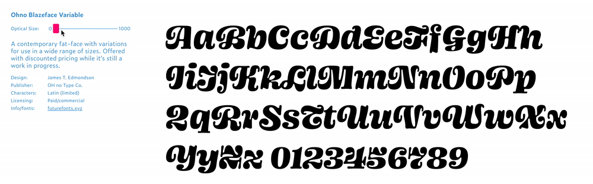

*OHno Blazeface keeps the x-height consistent and scales capitals*

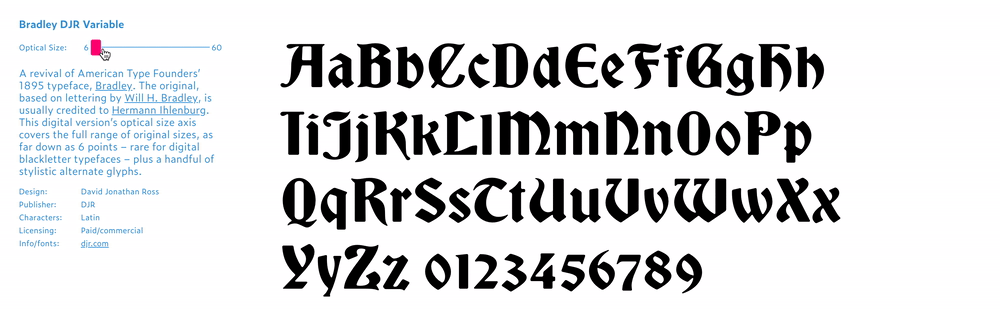

*DJR Bradley is a bit hard to see, but seems to keep x-height consistent while moving capitals*

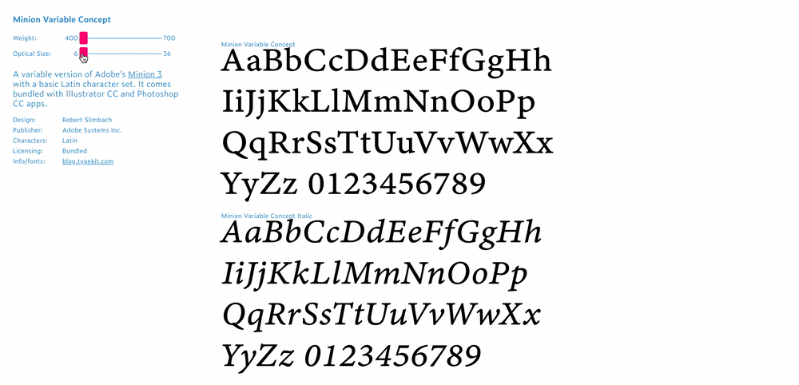

*Adobe Minion scales x-height while maintaining cap height*

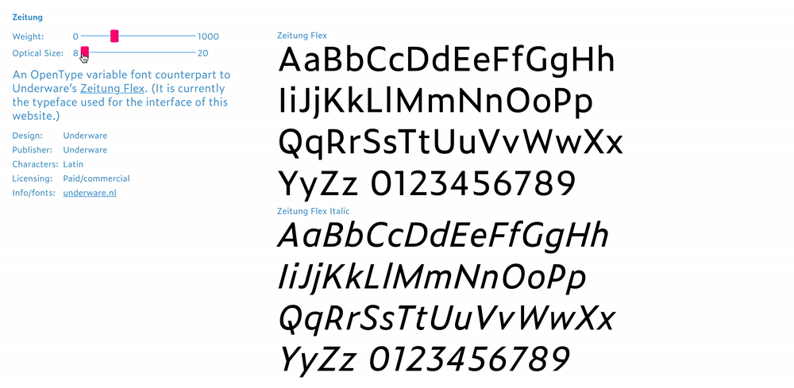

*Underware Zeitung is very subtle, mostly changing spacing, but also keeps cap-height consistent while scaling the x-height*

Clearly, there is no single definition of what *Optical Size* is or should be. Though most typefaces do use it to define the amount of thick/thin contrast in letterforms as well as overall letter spacing, it doesn't have a consistent, obvious meaning in terms of how vertical metrics are related. This probably means it's an open question that requires some design thought.

Here's a quick, rough comparison of LC Text & Display, matched either by cap height or x-height:

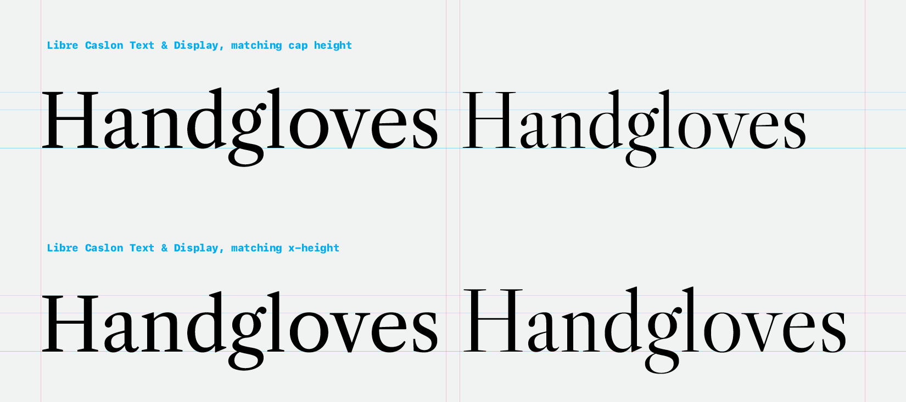

It seems clear that the first example changes overall visual size, including line-length, dramatically. Meanwhile, the second example (matching x-height) feels more like the same size of typeface – just with a few changed proportions, and doesn't change line length quite so dramatically. 

Two possible exceptions come to mind:
- What about when the type is set with more caps than lowercase?
    - While text is occasionally set in all-caps, observation of typography across websites and publications shows that text is set in mostly-lowercase letters, most of the time. Therefore, matching lowercase sizing will disrupt most text less than matching uppercase.
- What if this shifts the baseline of text, relative to the top of the body? Could that cause problems with a shifting baseline if people are setting or testing this as a variable font?
    - In Adobe software, the top of a textbox is dictated by the top point of a lowercase /d.I don't know offhand what dictates text positioning on the web... 
    - *However,* these styles will eventually be put into a single source file, which should match their baseline, even while other proportions change. Therefor, I don't think I have to worry about some arbitrary item changing baseline alignment between these styles.

With the decision to match x-height between Text and Display sizes, I simply have to compute the scaling factor to match the Display x-height to Text.

Libre Caslon Text's x-height is now `933` after previous scaling. Before scaling, LC Display's x-height is `424`. `933 / 424 = 2.200471698`. So, I'll scale LC Display to 2200 UPM, then change it to 2048 UPM. It seems to work well to match the x-Height:

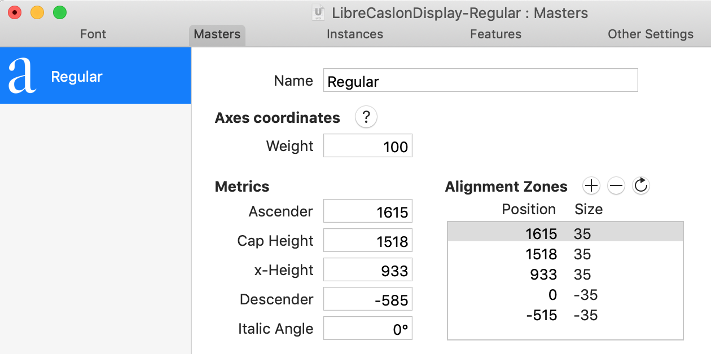

...and a quick InDesign test of both fonts exported, then at the same font size, shows that things are matching up pretty well:

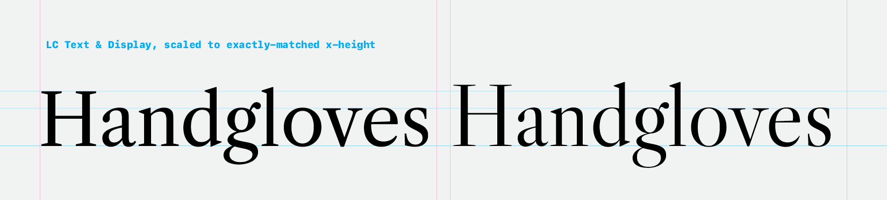

### Importing the Display into the Libre Caslon Text GlyphsApp source

I suspected that the baseline wouldn't change in InDesign if the fonts were exported from the same GlyphsApp source. So, I imported LC Display into the LC Text source file, then exported these as static fonts.

Unfortunately, InDesign is computing the text box sizing based on the height of the lowercase /d in each font style ... so the baseline *does* shift when the style is changed.

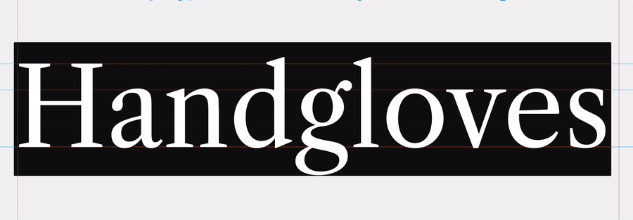

Additionally, putting LC Display into the GlyphsApp source file prevents successful FontMake exports, even though I have only set up Text instances.

As a side-effect, the imported Display seems to lose its former kerning between /v and /e. 

However, for now, my objective is simply to make the text styles publishable. So, I'll keep the Display out of the Text GlyhpsApp source, then fix these issues in the future.

## Italic

It appears that some of the italic may have been created by half-rotating, half-slanting the romans.

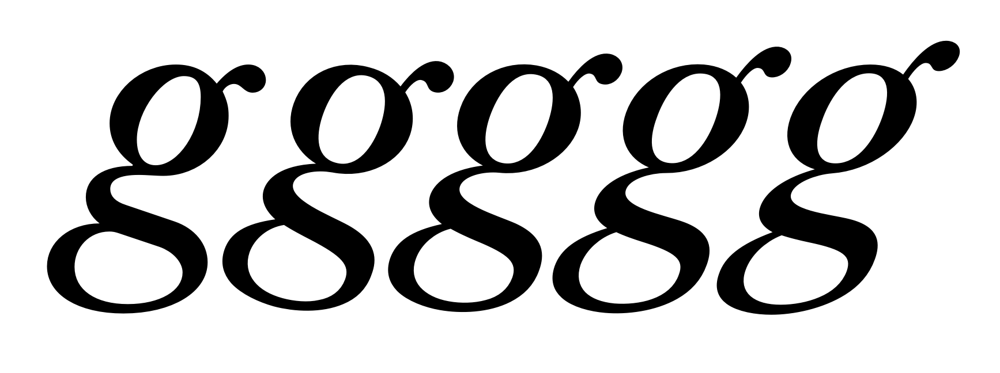

Above, from left to right:

- the existing italic `g`
- a `g` rotated 15° and skewed 5°
- a `g` rotated 10° and skewed 10° (this one looks pretty close to the current real version)
- a `g` rotated 5° and skewed 15°
- a `g` skewed 20°

This approach could be a quick starting point for the Bold Italic. On the other hand, it might mean that we should throw out much of what currently exists for the regular Italic, in order to do it better…
