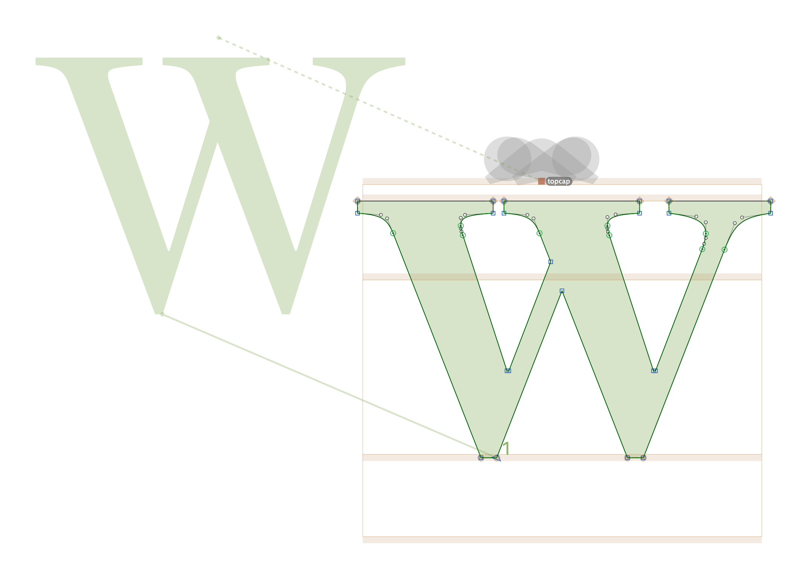
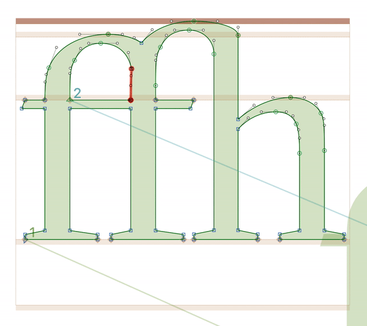
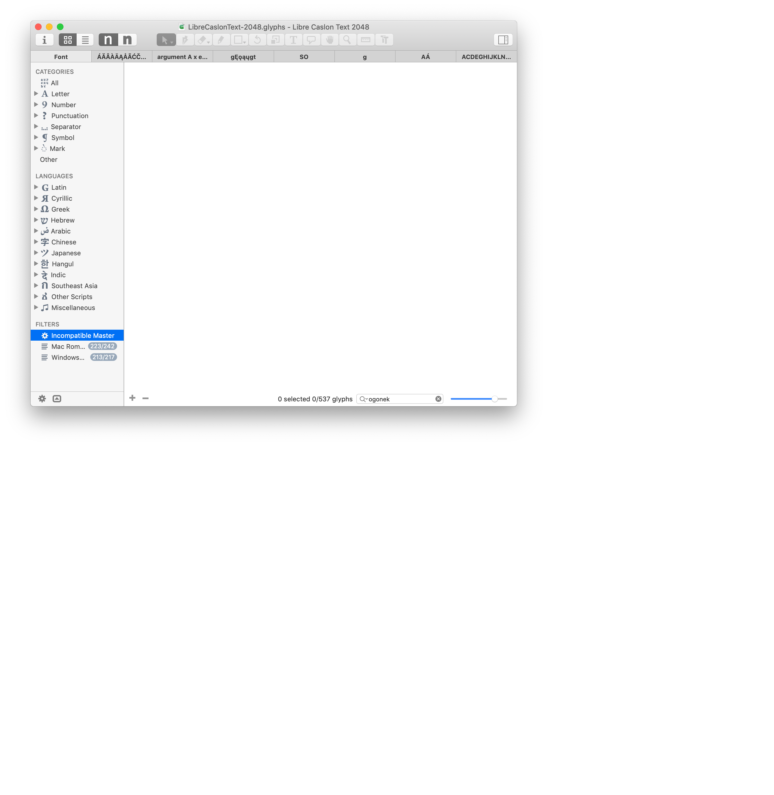
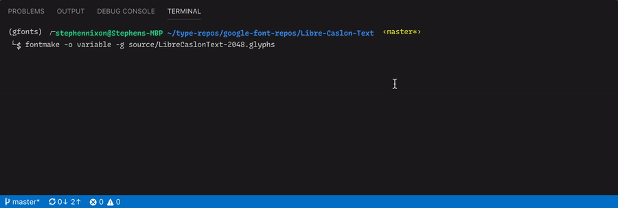
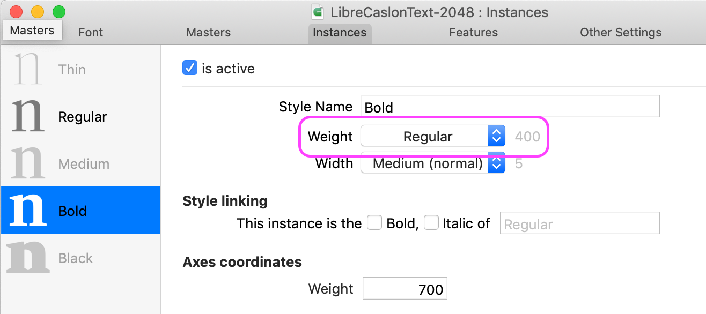
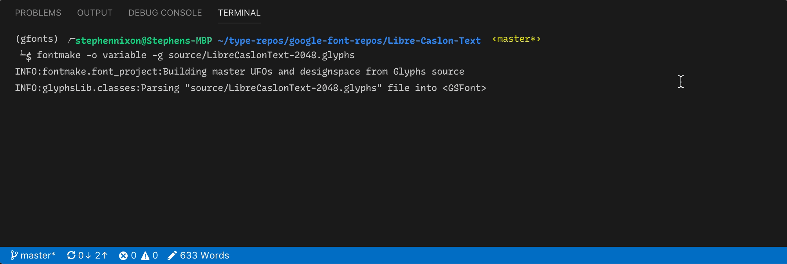
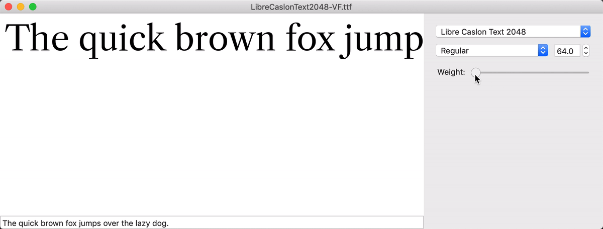

# Making Romans Compatible

As is documented in the Evaluation log, there are several incompatible glyphs to make compatible.


Because most of these seem to be about anchor points missing in the bold, I will first write a script to copy over the anchor points between masters, and then I will go through an adjust their positions in the bold master.

I'm starting by checking which glyphs have different amounts of anchors:

```
font = Glyphs.font

# help(font.masters[0])

for glyph in font.glyphs:
	if len(glyph.layers[0].anchors) !=  len(glyph.layers[1].anchors):
		print glyph.name, "\n"
		for layer in glyph.layers:
			if len(layer.anchors) > 0:
				print layer.name, "\n", layer.anchors,"\n", "\n"
```

Comparing just the amount of anchors, I get this:

```
A D E G H I J K L N O R S T U W Y Z c d dotlessi dotlessj h i k l o s w y z
```

I now need to find how to insert anchors into the glyphs that are missing them.

`anchors` is a "list, dict" within GSLayer. Glyphs says this can be done with:

```
# add a new anchor
layer.anchors['top'] = GSAnchor()
```

...and then I can probably set the x, y coordinates.

But actually, I had to use a `copy` method, like so:

```
import copy

font = Glyphs.font

for glyph in font.glyphs:
    if len(glyph.layers[0].anchors) !=  len(glyph.layers[1].anchors):
        print glyph.name
        # go through anchors
        for anchor in glyph.layers[0].anchors:
            # check if anchor exists in the anchors of next master
            if anchor.name not in glyph.layers[1].anchors.values():
                print anchor.name, anchor.x, anchor.y
                glyph.layers[1].anchors = copy.copy(glyph.layers[0].anchors)
                print "copied!"
                print "------", "\n" # separate anchors copied
        print "======", "\n" # separate glyphs
```

This copied all anchors that were missing in the Bold. These will require nudging to the correct placement, but it fixes most of the incompatible glyphs:


They require nudging because they are now like this:


Many of the anchors need to be centered optically, but many must be centered exactly horizontally, such as in the letter /H. I have quite a few anchors to center. To make this faster and more accurate, I'll use this script:

```
layer = Glyphs.font.selectedLayers[0] # current layer

for anchor in layer.anchors:
    if anchor.selected == True:
        centerXpos = layer.width/2
        anchor.x = centerXpos
        print(anchor.name, " moved to ", str(centerXpos))
```

### Fixing Ligatures

There are several ligatures which are incompatible. Their issue is very small, however:



### Fixing numerals

There are several incompatible numerals. However, these are relatively simple fixes.

Regular `/fiveinferior`, with a smooth bracket which is illogical in this typeface (where most brackets are sharp, especially coming from non-diagonal stems).


The Bold `/fiveinferior` is more logical.


With the off-point (curve) handles deleted in the Regular, the `/fiveinferior` is compatible.


This is similar in the `/seveninferior` and `seven.oldstyle`, so I will provide a similar solution.

The `/threeeights` fraction was simply in an inconsistent order, which was easily fixed by cutting and pasting the `/eightinerior`.

### Et voila! No incompatible glyphs.



This _should_ mean that a variable font can be generated. Let's see...

## Generating the variable font, v. 1

In a terminal, in my python virtual environment which is setup with [FontMake](https://github.com/googlei18n/fontmake), I run:

```
fontmake -o variable -g source/LibreCaslonText-2048.glyphs
```

And see what happens. It's close! But it needs some metadata cleanup.



Oops, looks like the master weight values are out of sorts. In the generated `.designspace` file, I can see this:

```
<axis default="400" maximum="400" minimum="400" name="Weight" tag="wght">
        <map input="400" output="700" />
</axis>
```

This shows that a range of values is not yet coming in from my Glyphs source. Let's fix that...

Looking in Font Info, I see that my masters have weight values of `400` and `700`, which I want.

However the "Bold" instance has a "Regular" weight value selected. This may be the problem:



Let's try it again:



It works!



Now, I can put this through FontBakery to find and fix any remaining metadata issues.
