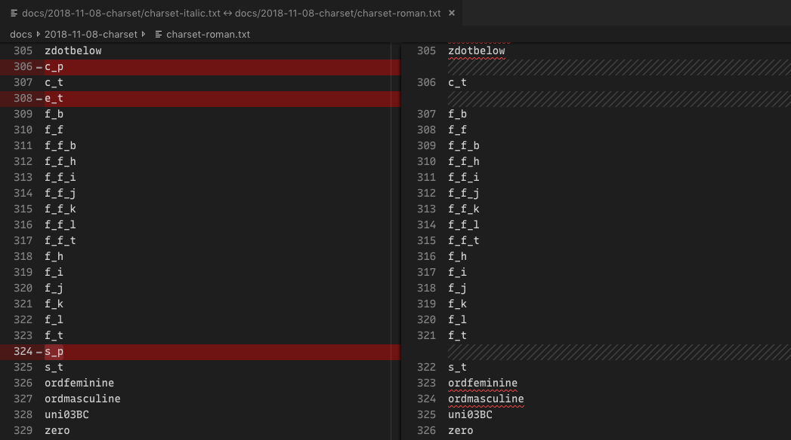

# Italic QA

**Italic items to close out**
- [x] make sure all glyphs are compatible (irrelevant for now – it's only a single weight)
- [x] check that charset matches between Regular and Italic
- [ ] repeat QA steps for Italic
  - [x] match vertical metrics to Roman
  - [ ] create build script tailored to Italic
- [ ] Make sure there is style linking between upright Regular and Regular Italic
- [ ] Set weight of Regular to better match other fonts
  - [ ] *but also* check that the Italic isn't too light when you do this.

## Charset

**Unique to Italic**
- ampersand.ss01
- c_p
- e_t
- s_p

I may not have to make the charsets entirely compatible because 
- These are only ligatures and an alternate ampersand
- I'm not planning to put the Roman and Italic into the same variable font file (in which case everything would have to be compatible)

## Create build script for italic

This will take a bit of figuring-out. It's only one weight, so ... do I try to build it as a variable font? Or will it style-link in a reasonable way if it's just a static font?

...to be continued.

# Remaining family to-do items

**In Roman**

- [ ] match updated spacing and kerning from diagonals to their accented variants – probably a script would work well for this (skipping the `i`-based letters)