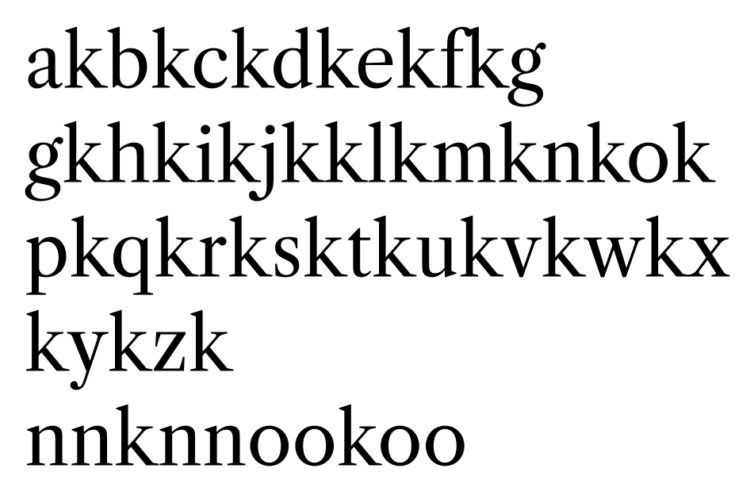
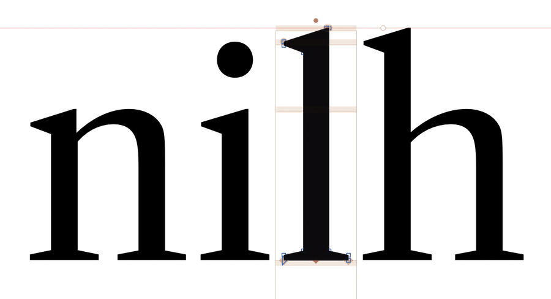

# Spacing Improvements

This font has quite a few issues with proportions and spacing.

I am avoiding changing it too much, because Dave has specifically asked me to keep a narrow focus on production as a variable font, for now, and stick to the original designs closely. 

However, a few things need to be fixed to prevent this from being a really awkward-to-use font.

## Adding kerning to "non-ligated sequences"

Overall, `k` was too-open on the right side. I reduced its right sidebearing, and kerned it a bit more tightly against glyphs `/a /f /t`. 

Before:

After (kerned in different lowercase combinations, mostly based on "nn" and "oo" spacing):

I also reduced sidebearings in diagonals: `/y/v/w`, as these were all quite loosely-spaced. 

This font could probably benefit from a more-methodical overall spacing upgrade, but that goes beyond the scope of this "just get it published" project, as it might also call into question the overall widths of some letters.

## Matching `/l` shape with other lowercase letterings

Previously, the Text Roman `/l` had a thinner stem and smaller serifs that other lowercase letters, like `/i` and `/h`. To better match sizing and spacing, I duplicated the main contour of the `/i` and matched its spacing. This brings the `/l` more in line with other ascenders, and increases its overly-tight spacing somewhat.

Before and after:

## Bringing spacing updates to component glyphs

By default, the spacing updates in foundation glyphs are not being automatically pulled into accented variants. Probably a script would work well to update spacing of these glyphs (skipping the `i`-based letters).

Relevant for: `/l /k /y /v /w`