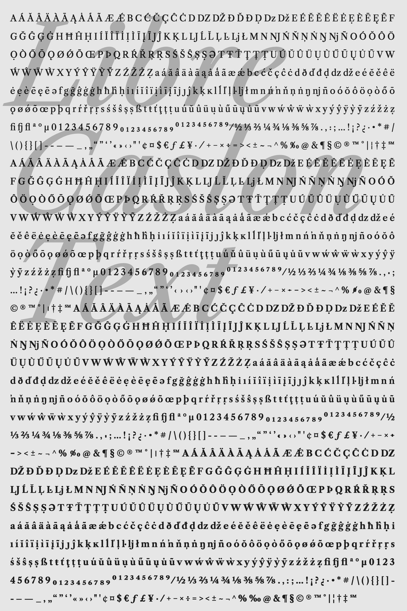
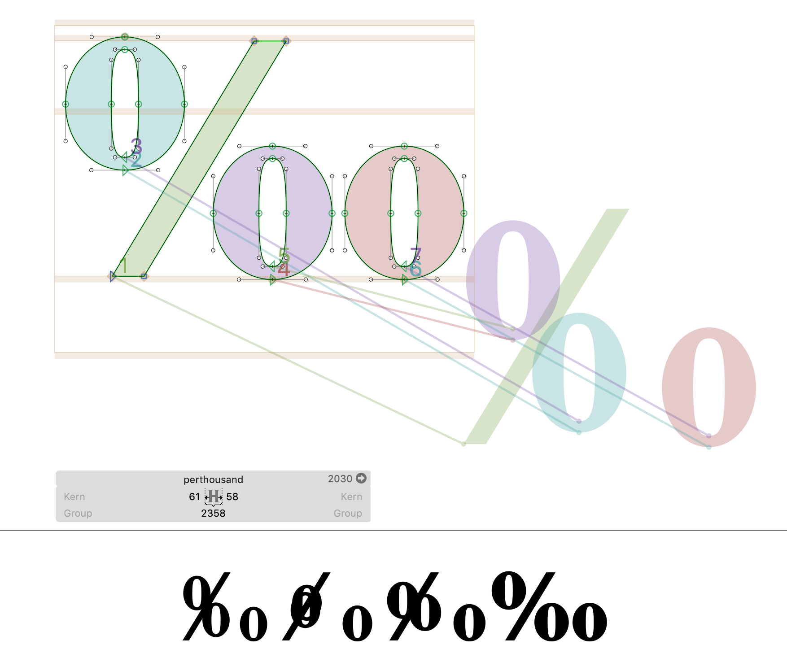
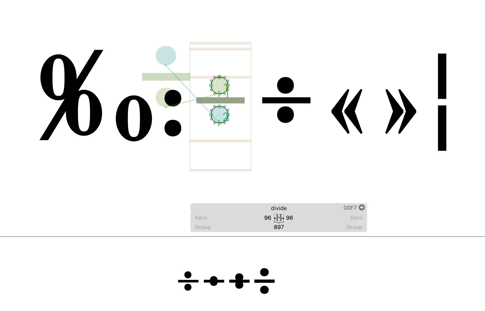

# Additional QA

This is a not-very-descriptive title, referring to QA done outside of FontBakery and my earlier QA work. This will encompass random issues I see crop up, plus specific Red Arrows / FontAudit checks.

## Drawbot Specimen

In making a specimen in Drawbot, I've noticed several interpolation errors.

Errors include:
- The `/perthousand` glyph has a messed-up interpolation from out-of-order contours.
- The 

Unfortunately, I have already adjusted the weight of the Regular master from an interpolated instance, so I can't simply fix contour order. I will have dig up the deleted file with the too-light "Regular" master, make a new instance, and copy in the glyphs from there. As far as I can tell, it's only `‰:÷/divide.tnum « » ¦`, so it shouldn't take long.

