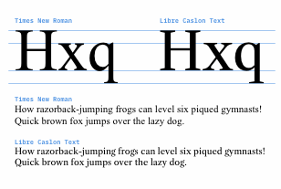

# Opening a Pull Request to the main Google Fonts repo

- [x] Make UPM 2000 to align with Dave's stated preference for VFs ([FontBakery Issue 2185](https://github.com/googlefonts/fontbakery/issues/2185))
    - [x] round kerns again with JAF freemix script
    - [x] check that font fits similarly to Times New Roman, as it was earlier
    - [x] repeat for italic

*It's not a perfect match, but they **are** different fonts, and they're quite close:*

- [ ] Do Red Arrows / FontAudit check of outlines

- [ ] Update build scripts to use new workflows from Encode Sans, in order to place fonts in appropriate `fonts/` folder

- [ ] Clean repo structure
    - [ ] Use `git mv` to move relevant files, delete others
    - [x] add more-comprehensive `.gitignore`
    - [ ] ? maybe make a `wip` branch? Probably not necessary...

- [ ] Add metadata files
  - [ ] `METADATA.pb` for statics
  - [ ] `METADATA.pb` for VF
  - [ ] `FONTLOG.txt`
  - [ ] Update `CONTRIBUTORS.txt` and `AUTHORS.txt`
  - [ ] Add build info to `README.md`

- [ ] Make sample image with Drawbot

- [ ] Add new fonts to google/fonts/ofl repo directory 

- [ ] open PR, add known remaining issues
